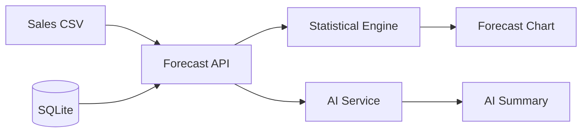
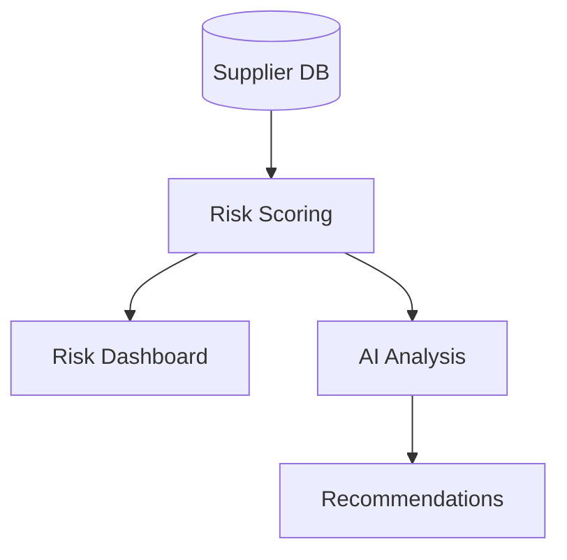
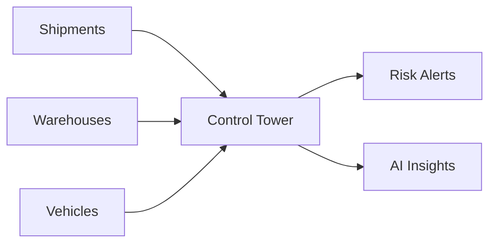
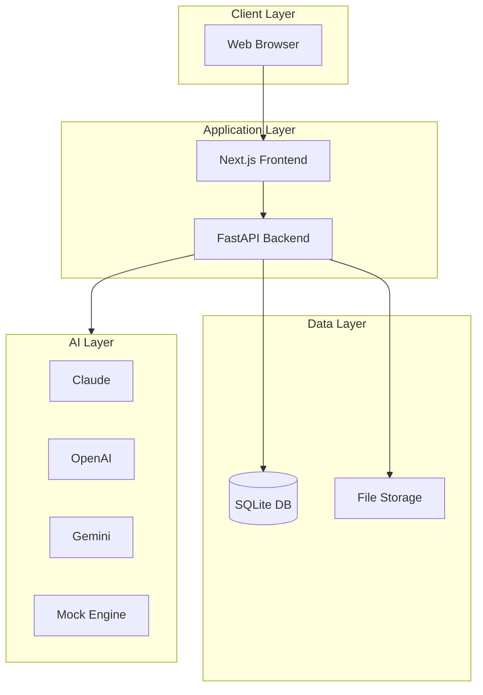
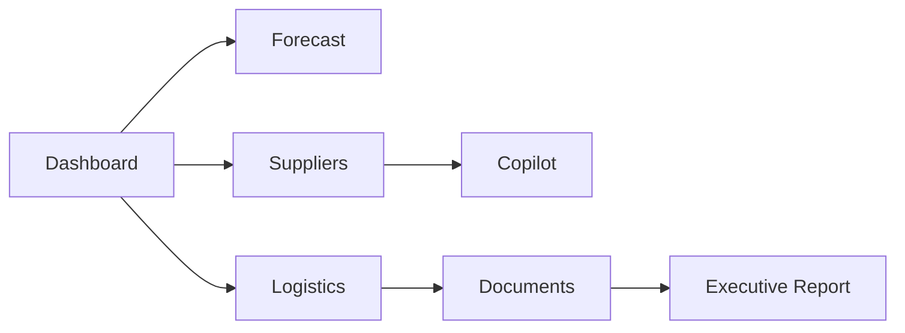
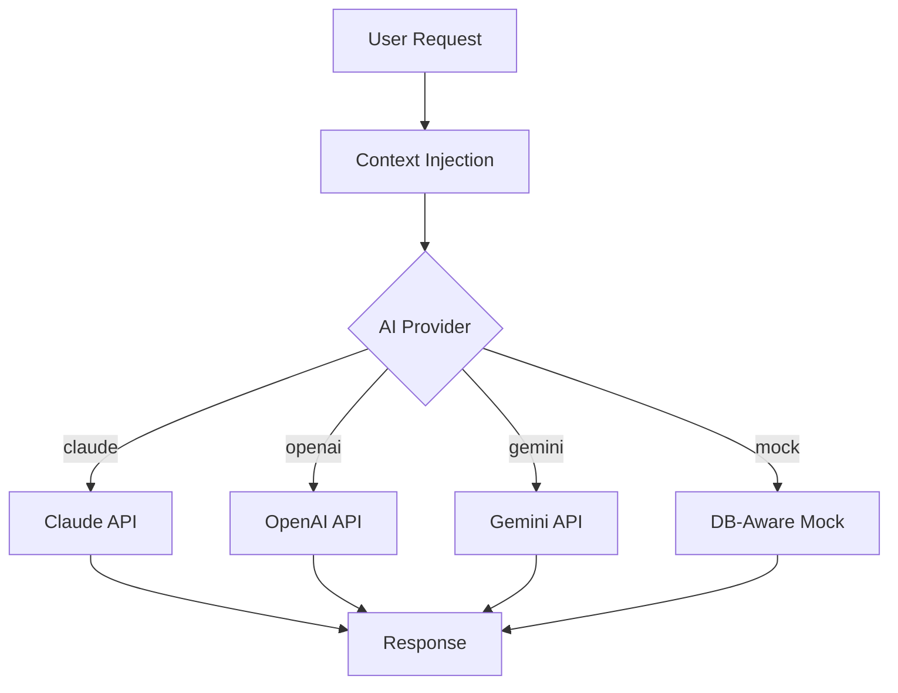
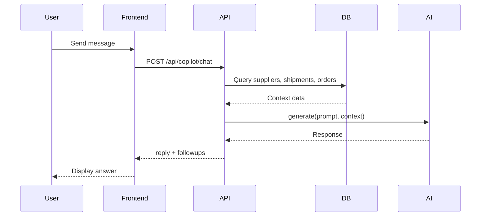

# Operyx AI Supply Chain PoC — Business Document

## Executive Summary

Operyx AI is an intelligent supply chain platform that combines real-time operational data with configurable AI to help enterprises predict demand, assess supplier risk, optimize logistics, and automate document processing. This proof of concept demonstrates seven integrated modules in a polished demo-ready application.

## Business Problem

Modern supply chains face:

- **Demand volatility** — Inaccurate forecasts lead to stockouts or excess inventory
- **Supplier disruption** — Single-source dependencies and opaque risk profiles
- **Logistics blind spots** — Delayed shipments discovered too late
- **Document friction** — Manual invoice/PO processing slows procurement

## Why AI in Supply Chain

AI transforms reactive supply chains into proactive, intelligent operations by:

- Analyzing patterns across historical sales, supplier performance, and shipment data
- Generating natural-language insights executives can act on immediately
- Automating document extraction and procurement Q&A
- Providing confidence-scored forecasts with safety stock recommendations

## Business Value

| Area | Value |
|------|-------|
| Forecast accuracy | 15–25% reduction in stockouts |
| Supplier risk | Early identification of at-risk vendors |
| Logistics | Real-time visibility into delays and capacity |
| Procurement | 40% faster document processing |
| Executive reporting | One-click strategic summaries |

## Target Customers

- Mid-to-large manufacturers and distributors
- Retailers with multi-warehouse operations
- Procurement teams managing 50+ suppliers
- Supply chain leaders needing control-tower visibility

---

## Use Case 1: AI Demand Forecasting

### Problem
Planners rely on spreadsheets and gut feel, missing seasonal patterns and leading to costly over/under-stocking.

### Solution
Upload sales history CSV, run statistical forecast (moving average + seasonality), get safety stock and confidence scores with AI narrative.

### Architecture

### Benefits
- Data-driven replenishment decisions
- Seasonality-aware projections
- Warehouse-level inventory recommendations

### KPIs
- Forecast MAPE < 15%
- Stockout rate reduction
- Inventory carrying cost optimization

### ROI
$500K–$2M annual savings for mid-size operations through reduced excess inventory and fewer stockouts.

---

## Use Case 2: Supplier Risk Intelligence

### Problem
Supplier issues surface only after delivery failures or quality incidents, causing production delays.

### Solution
Risk-scored supplier registry with contract tracking, delivery metrics, and AI-generated recommendations per supplier.

### Architecture

### Benefits
- Proactive vendor management
- Contract expiry visibility
- Diversification planning for high-risk suppliers

### KPIs
- On-time delivery rate
- Quality incident count
- Supplier risk score trend

### ROI
Avoiding a single major supplier disruption can save $1M+ in production downtime.

---

## Use Case 3: Supply Chain Control Tower

### Problem
Shipments, warehouse capacity, and fleet status live in disconnected systems with no unified view.

### Solution
Logistics dashboard with shipment tracking, warehouse utilization, vehicle fleet status, and automated risk alerts.

### Architecture

### Benefits
- Single pane of glass for logistics
- Early delay detection
- Capacity planning support

### KPIs
- On-time delivery %
- Warehouse utilization %
- Alert resolution time

### ROI
10–15% improvement in on-time delivery through proactive intervention.

---

## Enterprise Architecture

## Application Flow

## AI Workflow

## Sequence Diagram — Copilot Chat

## Conclusion

Operyx AI Supply Chain PoC demonstrates how AI-augmented supply chain management can deliver immediate business value across forecasting, risk management, logistics, and procurement — all in a demo-ready package that runs without external API dependencies.
