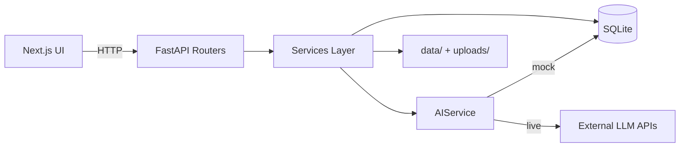

# Project Architecture

## Tech Stack

| Layer | Technology |
|-------|-----------|
| Frontend | Next.js 14 (App Router), TypeScript, Tailwind CSS, shadcn/ui, Recharts, lucide-react |
| Backend | FastAPI, SQLAlchemy, Pydantic, uvicorn |
| Database | SQLite |
| AI | Configurable: Claude, OpenAI, Gemini, Mock |
| Documents | pypdf, regex extraction |

## Folder Structure

```
operyx-ai/
├── frontend/
│   ├── app/                    # Next.js pages (7 modules)
│   │   ├── page.tsx            # Executive Dashboard
│   │   ├── forecast/
│   │   ├── suppliers/
│   │   ├── copilot/
│   │   ├── logistics/
│   │   ├── documents/
│   │   └── reports/
│   ├── components/
│   │   ├── ui/                 # shadcn/ui primitives
│   │   ├── charts/             # Recharts wrappers
│   │   ├── dashboard/          # KPI cards
│   │   └── layout/             # Sidebar, page shell
│   └── lib/
│       ├── api.ts              # Typed API client
│       └── utils.ts
├── backend/
│   ├── app/
│   │   ├── main.py             # FastAPI app + CORS
│   │   ├── config.py           # Settings from .env
│   │   ├── database.py         # SQLAlchemy engine
│   │   ├── seed.py             # DB seeding on startup
│   │   ├── models/             # ORM models
│   │   ├── schemas/            # Pydantic schemas
│   │   ├── routers/            # API route handlers
│   │   └── services/             # Business logic + AI
│   ├── scripts/
│   │   └── generate_data.py    # Sample data generator
│   └── requirements.txt
└── data/                       # Static seed files
```

## Data Flow



## Database Schema

| Table | Key Fields |
|-------|-----------|
| `suppliers` | name, risk_score, risk_level, contract_expiry, on_time_delivery_pct |
| `orders` | po_number, supplier_id, status, total_amount |
| `inventory` | sku, warehouse_id, quantity, unit_value, reorder_point |
| `warehouses` | name, capacity_units, used_units, utilization_pct |
| `shipments` | tracking_number, status, eta, origin, destination |
| `vehicles` | vehicle_id, status, location, capacity_tons |
| `sales_history` | sku, month, year, units_sold, revenue |
| `uploaded_documents` | filename, extracted_text, doc_type |

## AI Service Architecture

The `AIService` class provides a single `generate(prompt, context, system)` method:

1. Check `AI_PROVIDER` env var
2. If mock or no API key → return DB-aware mock response
3. Otherwise → call configured provider with injected supply chain context

Mock mode queries live data (suppliers, shipments, orders, inventory) to produce realistic demo responses.

## Frontend Architecture

- **App Router** — Each module is a route under `app/`
- **Client components** — Pages use `"use client"` for interactivity
- **API client** — `lib/api.ts` provides typed fetch wrappers to `http://localhost:8000`
- **Layout** — Fixed sidebar navigation with dark theme shell
- **Charts** — Recharts wrappers in `components/charts/`

## Startup Sequence

1. `uvicorn app.main:app` starts FastAPI
2. Lifespan hook calls `init_db()`
3. `seed.py` creates tables and loads data from `data/` if empty
4. Frontend connects to backend via CORS-enabled API

## Security Notes (PoC)

- No authentication (demo only)
- CORS restricted to configured origins
- File uploads stored locally in `backend/uploads/`
- API keys loaded from environment only
